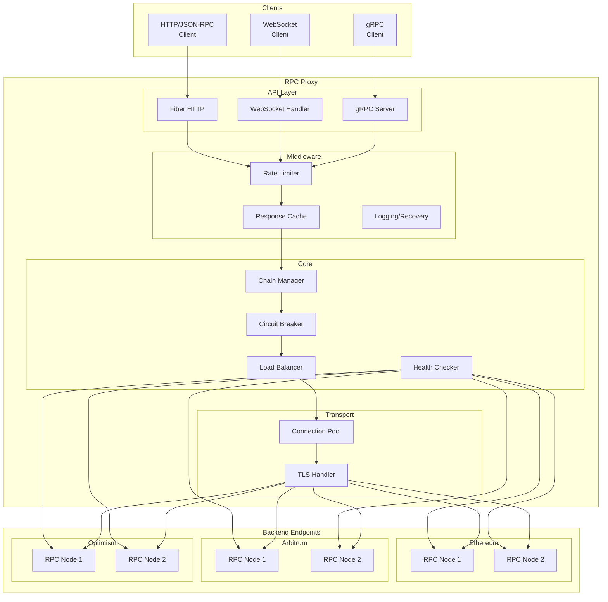

# Multichain RPC Proxy

[](https://gitpod.io/#https://github.com/bimakw/multichain-rpc-proxy)

[](https://go.dev/)
[](LICENSE)
[](https://github.com/bimakw/multichain-rpc-proxy)
[](https://hub.docker.com/)
[](https://github.com/bimakw/multichain-rpc-proxy/actions/workflows/ci.yml)

A high-performance, multi-chain RPC load balancer and proxy written in Go. Designed for blockchain infrastructure reliability with automatic health checking, failover, and comprehensive observability.

## Features

- **Multi-chain Support**: Ethereum, Arbitrum, Optimism, Base, Polygon (easily extensible)
- **Intelligent Load Balancing**: Weighted round-robin with automatic failover
- **Health Monitoring**: Continuous endpoint health checks with block height validation
- **Automatic Failover**: Seamless switching when endpoints become unhealthy
- **Block Lag Detection**: Mark endpoints unhealthy if they fall behind
- **Circuit Breaker**: Fault tolerance pattern to prevent cascade failures
- **WebSocket Support**: Full support for `eth_subscribe` and other subscription methods
- **Prometheus Metrics**: Full observability with custom blockchain metrics
- **Response Caching**: Cache static RPC calls (eth_chainId, net_version, etc.)
- **Rate Limiting**: Token bucket & sliding window algorithms with per-IP and per-chain limits
- **gRPC Support**: Full gRPC API with health checking service
- **TLS Support**: Server and client TLS for secure connections
- **Hot Config Reload**: Automatic reload on config file changes
- **Docker Ready**: Production-ready containerization with Compose stack

## Documentation

- [Architecture](docs/ARCHITECTURE.md) - System design and components
- [Configuration](docs/CONFIGURATION.md) - Full configuration reference
- [API Reference](docs/API.md) - HTTP endpoints and usage examples
- [Changelog](CHANGELOG.md) - Version history and release notes

## Quick Start

### Prerequisites

- Go 1.22+
- Docker & Docker Compose (optional)

### Run Locally

```bash
# Clone repository
git clone https://github.com/bimakw/multichain-rpc-proxy.git
cd multichain-rpc-proxy

# Download dependencies
go mod download

# Run
go run ./cmd/proxy -config configs/config.yaml
```

### Run with Docker

```bash
# Build and start
docker-compose up -d

# View logs
docker-compose logs -f proxy

# Stop
docker-compose down
```

## Usage

### RPC Endpoints

Send JSON-RPC requests to chain-specific endpoints:

```bash
# Ethereum
curl -X POST http://localhost:8080/ethereum \
  -H "Content-Type: application/json" \
  -d '{"jsonrpc":"2.0","method":"eth_blockNumber","params":[],"id":1}'

# Arbitrum
curl -X POST http://localhost:8080/arbitrum \
  -H "Content-Type: application/json" \
  -d '{"jsonrpc":"2.0","method":"eth_chainId","params":[],"id":1}'

# Optimism
curl -X POST http://localhost:8080/optimism \
  -H "Content-Type: application/json" \
  -d '{"jsonrpc":"2.0","method":"eth_getBalance","params":["0x...","latest"],"id":1}'
```

### Health Endpoints

```bash
# Overall health
curl http://localhost:8080/health

# Chain-specific health with endpoint details
curl http://localhost:8080/health/ethereum

# List all chains
curl http://localhost:8080/chains
```

### Metrics

Prometheus metrics available at `http://localhost:9090/metrics`:

| Metric | Description |
|--------|-------------|
| `rpc_proxy_requests_total` | Total requests per chain/method |
| `rpc_proxy_request_duration_seconds` | Request latency histogram |
| `rpc_proxy_endpoint_healthy` | Endpoint health status (1/0) |
| `rpc_proxy_block_height` | Highest block per chain |
| `rpc_proxy_endpoint_block_height` | Block height per endpoint |
| `rpc_proxy_endpoint_latency_ms` | Endpoint latency |
| `rpc_proxy_cache_hits_total` | Cache hits |
| `rpc_proxy_cache_misses_total` | Cache misses |
| `rpc_proxy_rate_limit_rejects_total` | Rate limit rejections |
| `rpc_proxy_healthy_endpoints` | Healthy endpoint count |
| `rpc_proxy_errors_total` | Error count by type |

## Configuration

Configuration is done via YAML file (`configs/config.yaml`):

```yaml
server:
  port: 8080
  read_timeout: 30s
  write_timeout: 30s

metrics:
  enabled: true
  port: 9090

rate_limit:
  enabled: true
  requests_per_second: 100
  burst: 200

cache:
  enabled: true
  ttl: 60s
  cacheable_methods:
    - eth_chainId
    - net_version
    - web3_clientVersion

chains:
  ethereum:
    chain_id: 1
    endpoints:
      - url: "https://eth.llamarpc.com"
        weight: 10
      - url: "https://rpc.ankr.com/eth"
        weight: 5
    health_check:
      interval: 10s
      timeout: 5s
      max_block_lag: 10

  arbitrum:
    chain_id: 42161
    endpoints:
      - url: "https://arb1.arbitrum.io/rpc"
        weight: 10
    health_check:
      interval: 10s
      timeout: 5s
      max_block_lag: 50
```

### Adding New Chains

Add a new chain section to the config:

```yaml
chains:
  avalanche:
    chain_id: 43114
    endpoints:
      - url: "https://api.avax.network/ext/bc/C/rpc"
        weight: 10
      - url: "https://rpc.ankr.com/avalanche"
        weight: 5
    health_check:
      interval: 10s
      timeout: 5s
      max_block_lag: 100
```

## Architecture



### Request Flow

```
┌─────────────────────────────────────────────────────────────┐
│                      Client Request                          │
│           (HTTP, WebSocket, or gRPC)                         │
└─────────────────────────────────────────────────────────────┘
                              │
                              ▼
┌─────────────────────────────────────────────────────────────┐
│                    Rate Limiter                              │
│        (Token Bucket / Sliding Window, Per-IP/Chain)         │
└─────────────────────────────────────────────────────────────┘
                              │
                              ▼
┌─────────────────────────────────────────────────────────────┐
│                    Cache Layer                               │
│           (In-memory or Redis for static calls)              │
└─────────────────────────────────────────────────────────────┘
                              │
                              ▼
┌─────────────────────────────────────────────────────────────┐
│                   Chain Manager                              │
│              (Route to correct chain)                        │
└─────────────────────────────────────────────────────────────┘
                              │
          ┌───────────────────┼───────────────────┐
          ▼                   ▼                   ▼
    ┌──────────┐        ┌──────────┐        ┌──────────┐
    │ Ethereum │        │ Arbitrum │        │ Optimism │
    │  Chain   │        │  Chain   │        │  Chain   │
    └──────────┘        └──────────┘        └──────────┘
          │                   │                   │
          ▼                   ▼                   ▼
    ┌──────────┐        ┌──────────┐        ┌──────────┐
    │ Circuit  │        │ Circuit  │        │ Circuit  │
    │ Breaker  │        │ Breaker  │        │ Breaker  │
    └──────────┘        └──────────┘        └──────────┘
          │                   │                   │
          ▼                   ▼                   ▼
    ┌──────────┐        ┌──────────┐        ┌──────────┐
    │   Load   │        │   Load   │        │   Load   │
    │ Balancer │        │ Balancer │        │ Balancer │
    └──────────┘        └──────────┘        └──────────┘
          │                   │                   │
    ┌─────┴─────┐       ┌─────┴─────┐       ┌─────┴─────┐
    ▼           ▼       ▼           ▼       ▼           ▼
┌───────┐ ┌───────┐ ┌───────┐ ┌───────┐ ┌───────┐ ┌───────┐
│ EP 1  │ │ EP 2  │ │ EP 1  │ │ EP 2  │ │ EP 1  │ │ EP 2  │
└───────┘ └───────┘ └───────┘ └───────┘ └───────┘ └───────┘
```

### Health Check Flow

1. Periodically call `eth_blockNumber` on all endpoints
2. Compare block heights across endpoints
3. Mark endpoints unhealthy if:
   - Request fails or times out
   - Block height lags behind by more than `max_block_lag`
4. Update Prometheus metrics

### Load Balancing Strategy

- **Weighted Round Robin**: Distribute requests based on endpoint weights
- **Automatic Failover**: Skip unhealthy endpoints
- **Retry Logic**: Retry failed requests on different endpoints

## Development

```bash
# Run tests
make test

# Run with coverage
make test-cover

# Format code
make fmt

# Run linter
make lint

# Build binary
make build
```

## Observability Stack

The included docker-compose provides a full observability stack:

- **Prometheus** (port 9091): Metrics collection
- **Grafana** (port 3000): Dashboards and visualization

### Import Grafana Dashboard

1. Open Grafana at `http://localhost:3000` (admin/admin)
2. Add Prometheus data source: `http://prometheus:9090`
3. Import dashboard from `dashboards/` or create your own

## Production Deployment

### Kubernetes

Example deployment manifest:

```yaml
apiVersion: apps/v1
kind: Deployment
metadata:
  name: multichain-rpc-proxy
spec:
  replicas: 3
  selector:
    matchLabels:
      app: rpc-proxy
  template:
    metadata:
      labels:
        app: rpc-proxy
    spec:
      containers:
      - name: proxy
        image: multichain-rpc-proxy:latest
        ports:
        - containerPort: 8080
        - containerPort: 9090
        resources:
          requests:
            cpu: 100m
            memory: 128Mi
          limits:
            cpu: 500m
            memory: 256Mi
        livenessProbe:
          httpGet:
            path: /health
            port: 8080
          initialDelaySeconds: 10
          periodSeconds: 10
        readinessProbe:
          httpGet:
            path: /health
            port: 8080
          initialDelaySeconds: 5
          periodSeconds: 5
```

## License

MIT License - see [LICENSE](LICENSE) for details.
